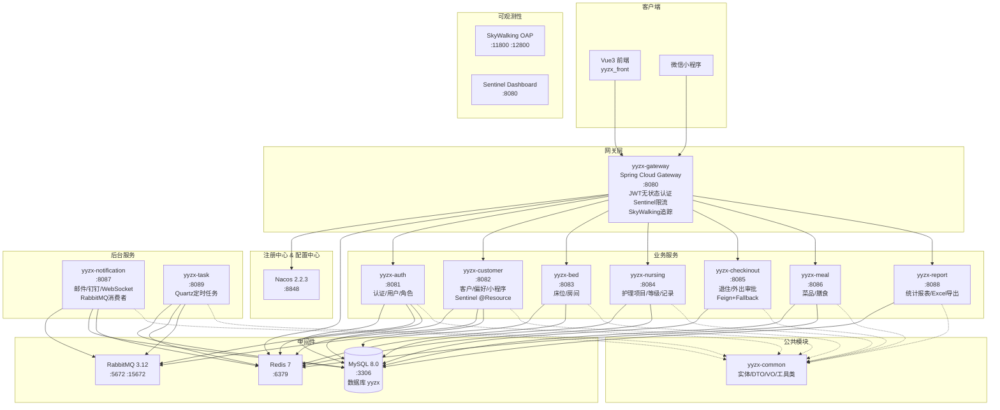
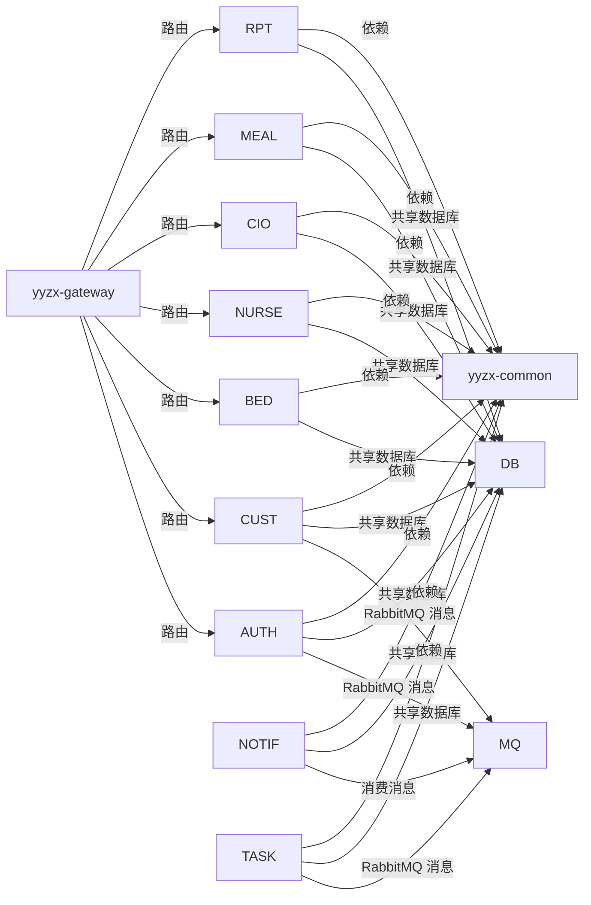
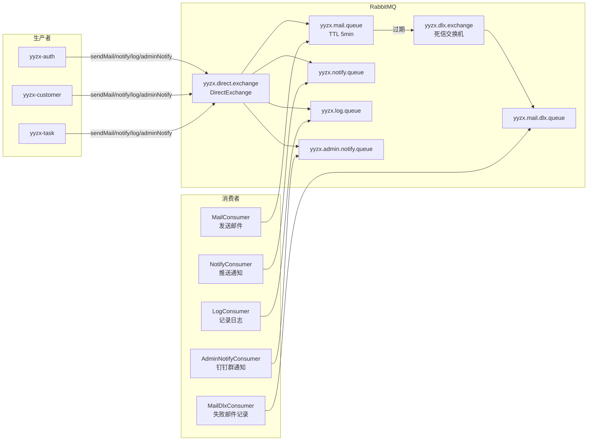
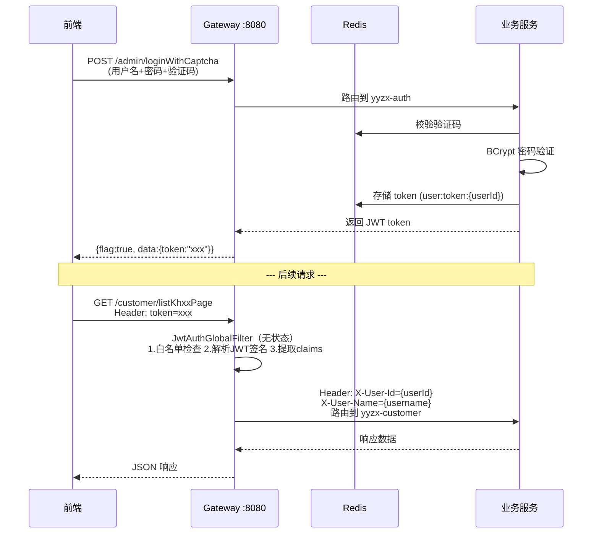

# 项目架构总览

> 颐养中心（yyzx）微服务架构文档  
> 由原单体 Spring Boot 项目 `yyzx_backend` 拆分而来

---

## 1. 架构图



---

## 2. 模块列表

| 序号 | 模块 | 端口 | 打包 | 说明 |
|------|------|------|------|------|
| 0 | `yyzx-common` | — | jar | 公共模块：实体类、DTO、VO、工具类、常量、异常、RabbitMQ生产者 |
| 1 | `yyzx-gateway` | 8080 | jar | API 网关：Spring Cloud Gateway + JWT 全局认证过滤器 |
| 2 | `yyzx-auth` | 8081 | jar | 认证服务：登录、验证码、用户管理、角色菜单（RBAC） |
| 3 | `yyzx-customer` | 8082 | jar | 客户服务：客户CRUD、偏好管理、护理项目分配、微信小程序登录 |
| 4 | `yyzx-bed` | 8083 | jar | 床位服务：床位CRUD、房间管理、床位交换 |
| 5 | `yyzx-nursing` | 8084 | jar | 护理服务：护理项目、护理等级、护理记录（Redis Lua 库存扣减） |
| 6 | `yyzx-checkinout` | 8085 | jar | 出入管理：退住审批、外出审批 |
| 7 | `yyzx-meal` | 8086 | jar | 膳食服务：菜品管理（含图片上传）、膳食计划 |
| 8 | `yyzx-notification` | 8087 | jar | 通知服务：RabbitMQ 消费者（邮件/通知/日志/管理员通知/死信队列）、钉钉机器人、WebSocket 推送 |
| 9 | `yyzx-report` | 8088 | jar | 报表服务：客户入住统计、财务统计、Excel 模板导出 |
| 10 | `yyzx-task` | 8089 | jar | 定时任务：Quartz（退住自动审批、失败邮件重试、延迟队列、周报） |

---

## 3. 技术栈版本

| 类别 | 技术 | 版本 |
|------|------|------|
| **语言** | Java | 1.8 |
| **框架** | Spring Boot | 2.7.18 |
| **服务调用** | OpenFeign + Resilience4j | 3.1.9 / 2.1.7 |
| **流量防卫** | Sentinel | (via SCA 2021.0.6.1) |
| **链路追踪** | SkyWalking Java Agent | 9.x |
| **微服务** | Spring Cloud | 2021.0.9 |
| **微服务** | Spring Cloud Alibaba | 2021.0.6.1 |
| **网关** | Spring Cloud Gateway | (via SC 2021.0.9) |
| **注册/配置** | Nacos | 2.2.3 |
| **负载均衡** | Spring Cloud LoadBalancer | (via SC 2021.0.9) |
| **ORM** | MyBatis-Plus | 3.5.1 |
| **连接池** | Druid | 1.2.6 |
| **数据库** | MySQL | 8.0.11 |
| **缓存** | Redis + Redisson | 7.x / 3.17.7 |
| **消息队列** | RabbitMQ | 3.12 |
| **定时任务** | Quartz | 2.3.2 |
| **认证** | JJWT + Auth0 JWT | 0.9.1 / 3.10.3 |
| **密码加密** | Spring Security Crypto (BCrypt) | 5.7.6 |
| **API 文档** | Knife4j (OpenAPI 3) | 4.4.0 |
| **JSON** | Fastjson | 1.2.76 |
| **Excel** | Apache POI | 3.16 |
| **验证码** | Kaptcha | 2.3.2 |
| **HTTP 客户端** | Apache HttpClient | 4.5.13 |
| **邮件** | Spring Boot Mail + Thymeleaf | managed |
| **WebSocket** | Spring Boot WebSocket | managed |
| **钉钉** | DingTalk SDK | 2.0.0 |
| **构建** | Maven | 3.6.3+ |

---

## 4. 服务间依赖关系



### 依赖说明

| 依赖类型 | 说明 |
|---------|------|
| **路由依赖** | Gateway 通过 Nacos 发现服务，使用 `lb://` 负载均衡转发请求 |
| **消息依赖** | 业务服务通过 `RabbitMQProducerService`（common）发送消息，`yyzx-notification` 统一消费 |
| **数据库依赖** | 共享数据库，各模块仅持有自己领域的 Mapper |
| **模块依赖** | 全部服务依赖 `yyzx-common`（Maven） |
| **服务调用** | OpenFeign 16 个端点覆盖全部跨模块调用，`FeignRequestInterceptor` 自动注入内部认证 Token |
| **内部认证** | `InternalAuthInterceptor` 校验 `/internal/**` 共享密钥，防止绕过 Gateway 直接访问 |

---

## 5. 消息队列架构



---

## 6. 认证流程



---

## 7. 高可用容错架构

```
请求: GET /customer/listKhxxPage
        │
        ├── [SkyWalking] TraceId 注入 ──────── 贯穿全链路
        │
        ├── [Sentinel Gateway] QPS 限流 ───── 超阈值 → HTTP 429
        │
        ├── [JWT Filter] 无状态签名校验 ───── 失败 → HTTP 401
        │
        ├── [Sentinel @Resource] listKhxxPage ─ 限流 → blockHandler
        │                                      ─ 异常 → fallback
        │
        └── [Feign + Resilience4j] 调用床位服务 ─ 超时/失败 → FallbackFactory
                                                  └─ 返回 ResultVo.fail("服务暂不可用")
```

### 熔断降级参数

| 层级 | 机制 | 参数 |
|------|------|------|
| Gateway | Sentinel 限流 | QPS 阈值（Dashboard 动态配置） |
| Controller | `@SentinelResource` | QPS=100 + 异常比例 50% 熔断 10s |
| Feign | Resilience4j FallbackFactory | 超时 5s，50% 失败率熔断，10s 半开 |
| 数据库 | Hikari/Druid 连接池 | 10~25 连接，3s 超时 |
| Internal API | InternalAuthInterceptor | X-Internal-Token 共享密钥 |

---

## 8. 安全架构

```
外部请求:
  浏览器 → Gateway (:8080) → JWT 无状态认证 → 路由到服务

内部 Feign 调用:
  Service A → FeignRequestInterceptor 注入 X-Internal-Token
            → Service B /internal/** → InternalAuthInterceptor 校验
            → ✅ 放行 / ❌ 403
```
